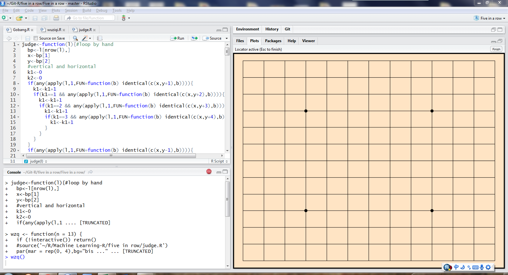
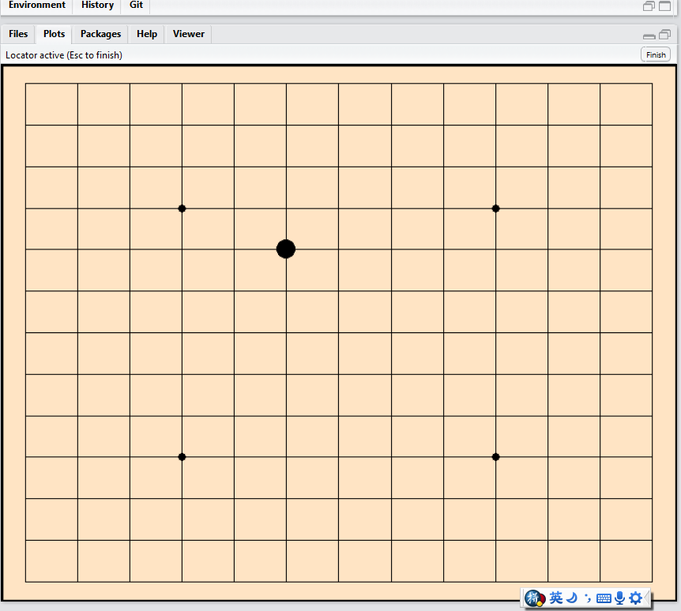
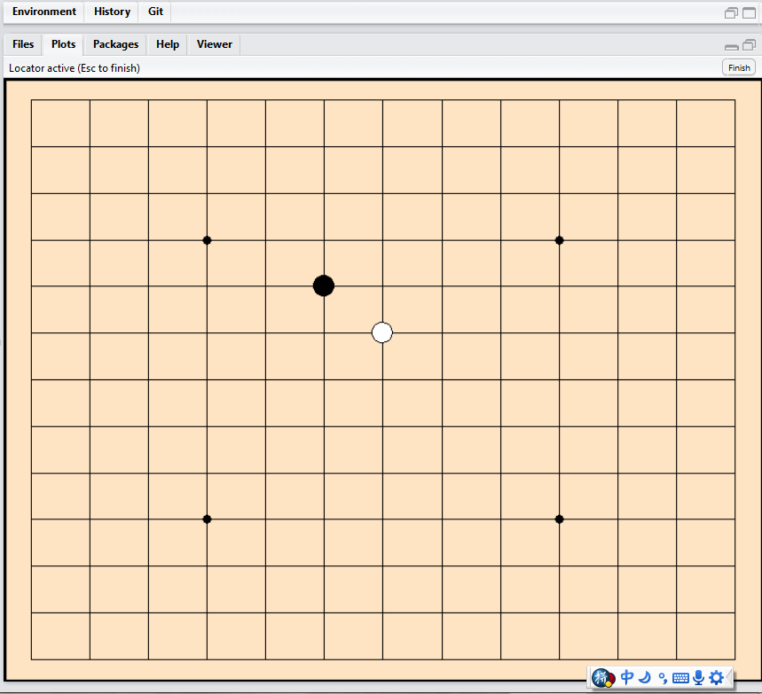
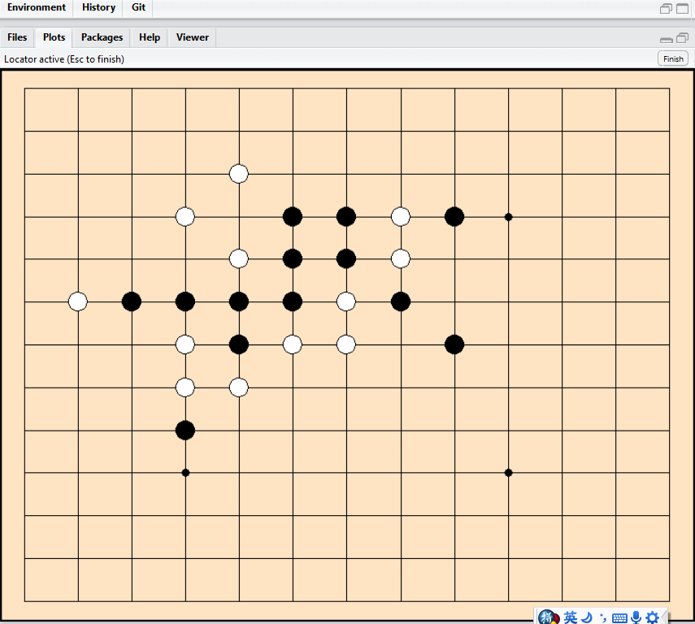
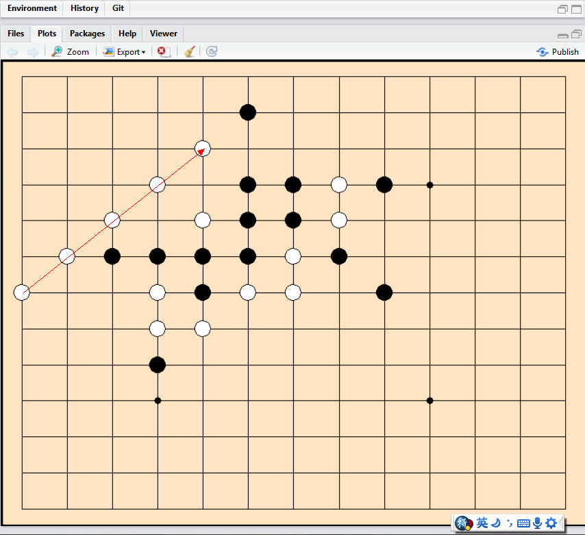

# Five-in-a-row-by-R
Use R to create the Five in a row or Gobang or Gomoku just for FUN.  

Load or source those two functions provided by Gobang.R in R.  

Run wzq() in console, we will see the board ready as below. 

  

Now just move the cursor to any point on the board and lift click to place the first stone. It is black. 

  

Move cursor to anywhere else and lift click to put the first white stone. 

    
 
Keep going.....  

     

Until someone get the first five same colored stone in line without any breaks points, the game will be over. 

 
